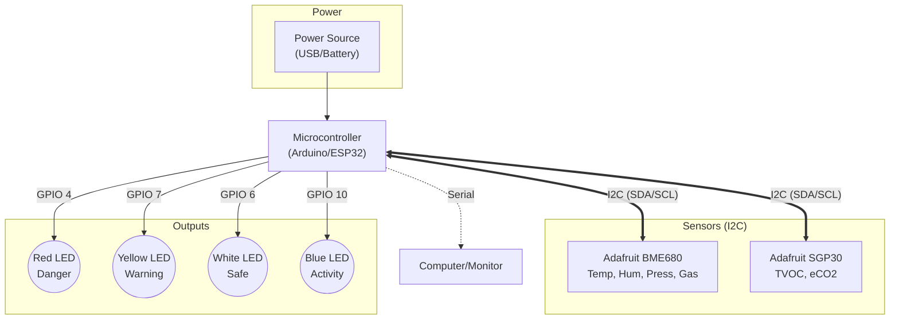

# 🌿 SAIoT Air Quality Monitor

**A smart, real-time environmental sensing node powered by Arduino/ESP32.**  
*Monitor air quality, detect hazardous gases/TVOCs, and get instant visual feedback.*

---

## 📖 Overview

The **SAIoT Air Quality Monitor** is an embedded system designed to keep your environment safe. By combining the precision of the **Adafruit BME680** (Gas, Temp, Humidity, Pressure) and the **Adafruit SGP30** (TVOC, eCO2), this device provides a comprehensive analysis of the air you breathe.

It features a **Traffic Light Logic** system that gives you immediate, intuitive status updates via colored LEDs—no need to check a screen to know if you're safe.

---

## 🏗️ System Architecture



---

## ✨ Key Features

- **Dual-Sensor Fusion**: Uses both BME680 and SGP30 for redundant and accurate air quality metrics.
- **Intelligent Feedback System**:
  - ⚪ **White**: Safe / Clean Air.
  - 🟡 **Yellow**: Warning / Pre-Alarm (Gas resistance dropping).
  - 🔴 **Red**: **DANGER** / Evacuate (High TVOC or Low Gas Resistance).
  - 🔵 **Blue**: Heartbeat (System is active and reading).
- **Real-Time Logging**: Outputs raw sensor data (Gas Ohms, TVOC) to the Serial Monitor.
- **Fail-Safe Design**: Automatically detects sensor failures and signals critical errors.

---

## 🛠️ Hardware Requirements

To build this project, you will need:

1.  **Microcontroller**: Any Arduino-compatible board supporting I2C (Code uses Pins 8/9 for SDA/SCL, typical for some ESP32/ESP32-C3/S3 boards).
2.  **Sensors**:
    *   [Adafruit BME680](https://www.adafruit.com/product/3660)
    *   [Adafruit SGP30](https://www.adafruit.com/product/3709)
3.  **Visual Indicators**:
    *   1x Red LED
    *   1x White LED (or Green)
    *   1x Yellow LED
    *   1x Blue LED
4.  **Resistors**: 220Ω or 330Ω resistors for each LED.
5.  **Wiring**: Breadboard and jumper wires.

---

## ⚡ Circuit & Wiring

Connect your components as follows:

### **I2C Connections**
| Sensor Pin | Microcontroller Pin | Function |
| :--- | :--- | :--- |
| **SDA** | GPIO 8 | I2C Data |
| **SCL** | GPIO 9 | I2C Clock |
| **VCC** | 3.3V / 5V | Power |
| **GND** | GND | Ground |

> **Note:** Ensure both setup sensors (BME680 & SGP30) share the I2C bus.

### **LED Indicators**
| LED Color | GPIO Pin | Meaning |
| :--- | :--- | :--- |
| 🔴 **Red** | 4 | **DANGER** (High Pollution) |
| ⚪ **White** | 6 | **SAFE** (Clean Air) |
| 🟡 **Yellow** | 7 | **WARNING** (Check Environment) |
| 🔵 **Blue** | 10 | **ACTIVITY** (Reading data) |

---

## 💻 Software & Installation

### 1. Prerequisites
- **Arduino IDE**: Download and install from [arduino.cc](https://www.arduino.cc/en/software).

### 2. Install Libraries
Open Arduino IDE and go to **Tools > Manage Libraries...**. Search for and install the following:
*   `Adafruit BME680 Library` (by Adafruit)
*   `Adafruit SGP30 Library` (by Adafruit)
*   `Adafruit Unified Sensor` (by Adafruit)

### 3. Setup and Upload
1.  **Clone/Download** this repository.
2.  Open `sensor_node.ino` in the Arduino IDE.
3.  Connect your microcontroller to your PC via USB.
4.  Select your correct **Board** and **Port** in `Tools`.
5.  Click the **Upload** button (➡️).

---

## 🚀 How to Use

1.  **Power On**: Connect the customized device to a power source (USB or Battery).
2.  **Boot Sequence**: You will see a quick light show (Blue -> Yellow -> White -> Red) confirming all LEDs are working.
3.  **Warm Up**: The sensors may need a few seconds (or minutes for SGP30 baseline) to stabilize.
4.  **Monitoring**:
    *   Observe the LEDs for instant status.
    *   Open **Serial Monitor** (Baud Rate: `115200`) to view detailed quantitative data:
        ```text
        >>> SISTEMA PRONTO <<<
        Gás (Ohms): 120500 | TVOC: 15
        Gás (Ohms): 98000 | TVOC: 22
        ```

---

## ⚙️ Configuration & thresholds

You can calibrate the sensitivity of the system by modifying the constants at the top of `sensor_node.ino`:

```cpp
// Resistance (Ohms). Higher = Cleaner Air.
const uint32_t GAS_LIMPO = 100000; 
const uint32_t GAS_AVISO = 40000;  
const uint32_t GAS_PERIGO = 15000; 

// Total Volatile Organic Compounds (ppb)
const uint16_t TVOC_PERIGO = 200; 
```

---

## 🤝 Contributing

Contributions are welcome! Please feel free to submit a Pull Request.

---

*Project for Faculdade SAIoT Class*
